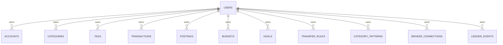

# Database schema — proposed, not built yet

This is a from-scratch, multi-user design for the Postgres schema this
repo would move to. It intentionally does not carry over any shape from
today's flat files — those hold only test data (see
`docs/app-stack/switching-to-a-database.md`, `docs/server-setup/postgres-future.md`)
and get deleted, not migrated, when this actually ships.

Every table below is scoped by `user_id`. Nothing in `accounting` or
`trades` is exempt — the moment more than one person uses this app, an
account, a category, a posting, a goal, a ledger event all belong to
*someone*, so there is no "shared" table for anything an individual owns.

## Design decisions worth calling out

**Composite primary keys, not surrogate ones, for anything the app already names.**
The pydantic models already hand out human-meaningful string IDs
(`account_id`, `category_id`, `posting_id`, ...) — e.g. every user's
default categories reuse the id `"uncategorized:expense"`. If `account_id`
alone were the primary key, two users could never both have an account
named that. So the primary key everywhere is **`(user_id, <thing>_id)`**,
and every foreign key is the same pair, never just the bare id. This also
means every query is naturally scoped by its leading key column
(`user_id`), which is good for both correctness and index locality.

**A table gets a surrogate `id BIGSERIAL`/`UUID` only when its natural key
includes a nullable column** (Postgres primary keys can't contain `NULL`).
`general_budgets` and the two "list of sub-objects" tables
(`posting_split_legs`, `posting_merge_duplicates`) fall into this.

**Row-Level Security (RLS), on top of app-level `WHERE user_id = ...`
filtering, not instead of it.** The app should still filter every query
explicitly — but RLS policies (`CREATE POLICY ... USING (user_id =
current_setting('app.current_user_id')::uuid)`) are a second, database-
enforced guarantee: even a bug that forgets the `WHERE` clause can't leak
another user's rows. This is exactly the kind of belt-and-suspenders a
shared multi-tenant database needs, and it's cheap to add once tables
exist.

**Lists become child tables, not arrays**, wherever the list holds
*referenced* things (tag ids, split legs, merge duplicates) — proper
foreign keys, cascade deletes, and joinable/indexable, rather than an
opaque array Postgres can't enforce referential integrity on. The one
exception is `manual_overrides.tag_ids`, which is a sparse *patch* (`NULL`
= "no override", not "override to empty") rather than a canonical entity
list — that stays a nullable `TEXT[]`.

**`transactions` is a new table that doesn't exist as a pydantic model
today.** Right now `transaction_id` is just a string multiple postings
happen to share, with nothing else describing "the transaction" as a
whole. In Postgres that's an orphanable foreign key with nothing to point
at — so it gets reified as a real table postings and merges reference,
rather than staying a bare, unenforced string.

**Broker credentials never land in a plain column.** `broker_connections`
stores a reference/pointer, not a raw IBKR token — actual encryption-at-
rest strategy is a separate decision (e.g. app-level encryption with a key
from a secrets manager), out of scope for the schema itself but flagged
so it isn't silently forgotten later.

**Global reference data — prices, CPI, HYSA rates — deliberately stays out
of Postgres, as flat-file cache.** These aren't anyone's data: every user
sees the same `AAPL` close on the same day. They're already
described in `docs/trades/architecture.md` as cheap, deduped, re-fetchable
caches with no privacy dimension — adding `user_id` to them would be pure
duplication (the same row, once per user, forever). They stay exactly
where they are today (`data/trades/prices/`, `cpi/`, `hysa_rates/`).

**Raw statement archives (broker Flex XML, bank PDFs/CSVs) move to object
storage (Cloudflare R2 — already scaffolded in `.env.docker.example`), not
Postgres, not local disk.** These *are* per-user, so they can't keep
landing in one shared `data/` folder once there's more than one person —
but they're also large, immutable blobs, exactly what object storage is
for, not what a relational database is for. Keyed by `{user_id}/{source}/{timestamp}-{filename}`.
This still honors the repo's "archive raw, derive everything else" rule
(`CLAUDE.md`) — R2 *is* the archive; Postgres holds only what's derived
from it.

---

## Overview



Everything hangs off `users`. The sub-diagrams below expand each branch
with full columns.

### `users` (auth — schema only; login itself is later work)

| column | type | notes |
|---|---|---|
| `id` | `uuid` PK | matches what `fastapi-users` expects, if/when auth is added |
| `email` | `text` unique, not null | |
| `hashed_password` | `text` | never a plaintext column |
| `is_active` | `boolean` default true | |
| `is_superuser` | `boolean` default false | |
| `is_verified` | `boolean` default false | |
| `created_at` | `timestamptz` default now() | |

Seeded with exactly one row for now (you) — every other table's `user_id`
foreign-keys here regardless of whether login exists yet.

---

## Accounting: core ledger

```mermaid
erDiagram
    USERS ||--o{ ACCOUNTS : owns
    ACCOUNTS |o--o{ ACCOUNTS : "parent_account_id (vaults)"
    USERS ||--o{ CATEGORIES : owns
    CATEGORIES |o--o{ CATEGORIES : "parent_category_id (subcategories)"
    USERS ||--o{ TAGS : owns
    USERS ||--o{ TRANSACTIONS : owns
    TRANSACTIONS ||--o{ POSTINGS : "legs of"
    ACCOUNTS ||--o{ POSTINGS : "posted to"
    CATEGORIES |o--o{ POSTINGS : categorizes
    POSTINGS ||--o{ POSTING_TAGS : ""
    TAGS ||--o{ POSTING_TAGS : ""
    ACCOUNTS ||--o| OPENING_BALANCES : ""
    ACCOUNTS ||--o{ MANUAL_TRANSFERS : "from/to"
    USERS ||--o{ OTHER_ASSETS : owns

    ACCOUNTS {
        uuid user_id PK_FK
        text account_id PK
        text name
        text kind
        text institution
        text currency
        text parent_account_id FK
        text external_ref
        jsonb meta
        boolean closed
    }
    CATEGORIES {
        uuid user_id PK_FK
        text category_id PK
        text name
        text classification
        text parent_category_id FK
        text color
    }
    TAGS {
        uuid user_id PK_FK
        text tag_id PK
        text name
    }
    TRANSACTIONS {
        uuid user_id PK_FK
        text transaction_id PK
        timestamptz created_at
    }
    POSTINGS {
        uuid user_id PK_FK
        text posting_id PK
        text transaction_id FK
        text account_id FK
        timestamptz posted_at
        numeric amount
        text currency
        text category_id FK
        text subcategory_id FK
        text budget_id FK
        text description
        jsonb meta
    }
    POSTING_TAGS {
        uuid user_id PK_FK
        text posting_id PK_FK
        text tag_id PK_FK
    }
    OPENING_BALANCES {
        uuid user_id PK_FK
        text account_id PK_FK
        numeric amount
        timestamptz as_of_date
    }
    MANUAL_TRANSFERS {
        uuid user_id PK_FK
        text transfer_id PK
        timestamptz date
        text from_account_id FK
        text to_account_id FK
        numeric from_amount
        numeric to_amount
        text description
    }
    OTHER_ASSETS {
        uuid user_id PK_FK
        text asset_id PK
        text name
        numeric value
        text currency
        text note
    }
```

Indexes worth having from day one: `postings(user_id, account_id,
posted_at)` (balance/history queries), `postings(user_id, transaction_id)`
(assembling a transaction's legs), `postings(user_id, category_id,
posted_at)` (income statement / budget actuals).

`amount` is `numeric`, not `float` — money should never be
floating-point in a database, regardless of what the Python side uses
(polars/pydantic can keep `float` for in-memory math; Postgres is the one
place a rounding bug becomes silently uncorrectable).

---

## Accounting: automation, budgets, corrections

```mermaid
erDiagram
    USERS ||--o{ TRANSFER_RULES : owns
    USERS ||--o{ CATEGORY_PATTERNS : owns
    USERS ||--o{ BUDGETS : owns
    USERS ||--o{ GENERAL_BUDGETS : owns
    POSTINGS ||--o| MANUAL_OVERRIDES : "corrects"
    POSTINGS ||--o| POSTING_SPLITS : "splits"
    POSTING_SPLITS ||--o{ POSTING_SPLIT_LEGS : ""
    TRANSACTIONS ||--o{ POSTING_MERGES : "kept as"
    POSTING_MERGES ||--o{ POSTING_MERGE_DUPLICATES : ""
    USERS ||--o{ DISMISSED_SUGGESTIONS : owns

    TRANSFER_RULES {
        uuid user_id PK_FK
        text rule_id PK
        text description_contains
        text account_id FK
        text category_id FK
        text subcategory_id FK
        text counterparty_account_id FK
        int priority
        text description
        boolean active
    }
    CATEGORY_PATTERNS {
        uuid user_id PK_FK
        text pattern_id PK
        text description_contains
        text category_id FK
        text subcategory_id FK
        int priority
        boolean active
    }
    BUDGETS {
        uuid user_id PK_FK
        text budget_id PK
        text month
        text category_id FK
        text subcategory_id FK
        numeric amount
        text currency
    }
    GENERAL_BUDGETS {
        bigint id PK
        uuid user_id FK
        text category_id FK
        text subcategory_id FK
        numeric amount
        text currency
    }
    MANUAL_OVERRIDES {
        uuid user_id PK_FK
        text posting_id PK_FK
        text account_id FK
        text category_id FK
        text subcategory_id FK
        text tag_ids_override "nullable TEXT[]"
        text pending_source
        boolean pending_selected
        text pending_previous_category_id
        text pending_previous_subcategory_id
    }
    POSTING_SPLITS {
        uuid user_id PK_FK
        text posting_id PK_FK
    }
    POSTING_SPLIT_LEGS {
        bigint id PK
        uuid user_id FK
        text posting_id FK
        int ordinal
        numeric amount
        text category_id FK
        text subcategory_id FK
        text description
    }
    POSTING_MERGES {
        uuid user_id PK_FK
        text merge_id PK
        text kept_transaction_id FK
        text description
    }
    POSTING_MERGE_DUPLICATES {
        uuid user_id PK_FK
        text merge_id PK_FK
        text duplicate_transaction_id PK_FK
    }
    DISMISSED_SUGGESTIONS {
        uuid user_id PK_FK
        text suggestion_id PK
        text kind
        text description
        timestamptz dismissed_at
    }
```

`general_budgets` gets the surrogate `id` because its natural key
(`category_id` + optionally-null `subcategory_id`) can't be a primary key
directly — a `UNIQUE` index using
`(user_id, category_id, COALESCE(subcategory_id, ''))` enforces "one
general budget per category/subcategory" instead.

---

## Accounting: goals

```mermaid
erDiagram
    USERS ||--o{ GOALS : owns
    GOALS ||--o{ GOAL_CONTRIBUTIONS : accumulates
    GOALS ||--o{ RECURRING_ADDITIONS : "funded by"
    GOALS ||--o| WITHDRAWAL_PRIORITY_ENTRIES : ""
    POSTINGS |o--o{ GOAL_CONTRIBUTIONS : "source_posting_id"

    GOALS {
        uuid user_id PK_FK
        text goal_id PK
        text name
        numeric target_amount
        text target_currency
        timestamptz target_date
        text color
        timestamptz created_at
    }
    GOAL_CONTRIBUTIONS {
        uuid user_id PK_FK
        text contribution_id PK
        text goal_id FK
        timestamptz date
        numeric amount
        text currency
        text note
        text source_posting_id FK
        text origin
        boolean edited
    }
    RECURRING_ADDITIONS {
        uuid user_id PK_FK
        text addition_id PK
        text goal_id FK
        date start_date
        text frequency
        date end_date
        text mode
        numeric value
        text currency
        int priority
    }
    WITHDRAWAL_PRIORITY_ENTRIES {
        uuid user_id PK_FK
        text goal_id PK_FK
        int priority
    }
```

---

## Trades (per-user brokerage ledger)

```mermaid
erDiagram
    USERS ||--o{ BROKER_CONNECTIONS : owns
    BROKER_CONNECTIONS ||--o{ LEDGER_EVENTS : produces
    USERS ||--o{ SIMULATOR_SCENARIOS : owns

    BROKER_CONNECTIONS {
        uuid user_id PK_FK
        text connection_id PK
        text broker "e.g. ibkr"
        text external_account_id
        text credentials_ref "pointer, never a raw token"
        timestamptz created_at
    }
    LEDGER_EVENTS {
        uuid user_id PK_FK
        text event_id PK
        text connection_id FK
        timestamptz event_datetime
        text symbol
        text event_type
        numeric shares
        numeric price
        numeric amount
        text currency
        jsonb meta
    }
    SIMULATOR_SCENARIOS {
        uuid user_id PK_FK
        text scenario_id PK
        text name
        numeric initial_capital
        numeric monthly_contribution
        numeric horizon_years
        numeric annual_rate_pct
        text compounding_frequency
        text currency
    }
```

`broker_connections` is new — today's single global `.env` (`IBKR_QUERY_ID`,
`IBKR_FLEX_WEB_SERVICE_TOKEN`) only works for one person. Multi-user means
each user's own IBKR (or other broker) credentials have to be stored per
row here, not read from process env.

---

## Deliberately not in Postgres

| Data | Where it lives instead | Why |
|---|---|---|
| Daily close prices, CPI index, HYSA rates | `data/trades/{prices,cpi,hysa_rates}/` (flat CSV, as today) | Global, identical for every user, cheap and safe to re-fetch — adding `user_id` would only duplicate rows |
| Raw IBKR Flex XML, raw bank statement PDFs/CSVs | Cloudflare R2, keyed by `user_id` | Per-user, but large immutable blobs — object storage's job, not a relational database's; still the untouched "archive raw" copy `CLAUDE.md` requires |

---

## What this schema deliberately defers

- **Auth itself** (`users.hashed_password` actually being checked, sessions/JWTs) —
  the schema is auth-shaped so nothing here needs to change *when* that's
  built, but the login flow itself is separate work
  (`docs/app-stack/authentication-and-authorization.md`).
- **RLS policies** — noted above as the right move, not yet written; needs
  the app to actually set `current_setting('app.current_user_id')` per
  request, which depends on auth existing first.
- **Broker credential encryption** — `credentials_ref` is a placeholder;
  the actual secrets-storage mechanism is a separate decision.
